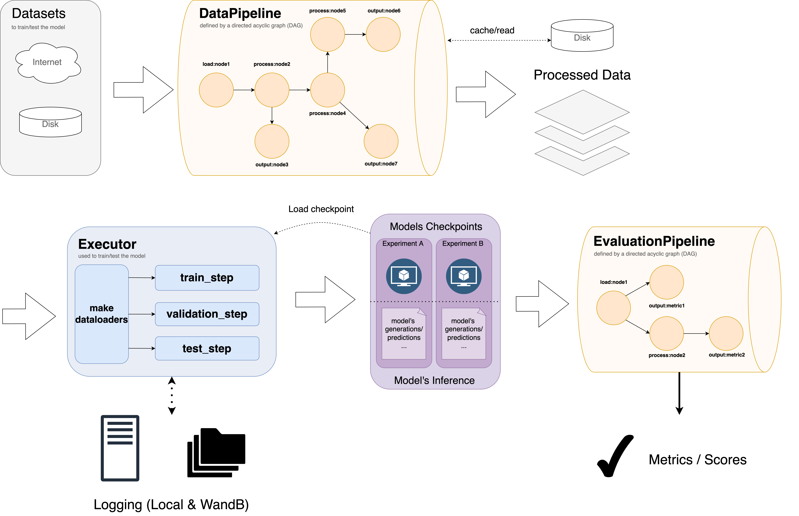

# runway_for_ml


# Overview

**Runway** is a ML framework built upon `pytorch-lightning` that delivers the last-mile solution so that researchers and engineers can focus on the essentials in ML research. The key features are:

1. A configurable functional **data processing pipeline** that is easy to inspect, use, and extend.
2. An **experiment configuration system** to conduct experiments in different settings without changing the code.
3. A **systematic logging system** that makes it easy to log results and manage experiments both locally or on online platforms (e.g. weights-and-bias)
4. A set of tools that simplifies **training/testing on remote GPU clusters** (e.g. HPC/Multiple GPU training)

With *Runway*, we hope to help ML researchers and engineers focus on the essential part of machine learning - data processing, modeling, inference, training, and evaluation. Our goal is to build a robust and flexible framework that gives developers complete freedom in these essential parts, while removing the tedious book-keeping. 

# Runway delivers research-ready ML pipeline



Runway organizes research ML pipeline into four stages:

1. Data Preprocessing
2. Training
3. Testing / Inference
4. Evaluation

You can define and configure each stage in the configuration file (a jsonnet file), and use the compositionality of jsonnet to modularize your config. 

## Data Preprocessing

In this stage, we preprocess our dataset for training and testing. The preprocessing is defined as a directed acyclic graph (i.e., graph with directional edges and no loops), where each node is a functional transform that takes some data and return the processed data.

Except for the first node (with name `load:<node_name>`), all other nodes will take the output of the `input_node` as its input. The node will set up (by calling `setup()`) and call the functor specified (i.e., a callable object, initialized from a class with `__call__` defined) to process the data. 

A pipeline is defined by a dictionary of node declaration, following the format:

```json
{
  "transforms": {
    "input:NameOfNode": { # name of the node 
      "input_node": "name of input node", 
      "transform_name": "name of your functor", 
      "setup_kwargs": { # used to setup the functor
        "arg_name1": "value1",
        "arg_name2": "value2",
      },
      "regenerate": false, # whether to re-run the transform, regardless of whether cache can be read
      "cache": true, # whether to save the data to cache
      "inspect": true # whether to get information printed for debugging or sanity checking
    }
  }
}
```

## Training and Testing

Training and Testing are handled by `Executor`s. An `Executor` is just a subclass of pytorch-lightning"s `LightningModule`, where we define:

1. How to make the train/test/validation dataloaders
2. How to perform train/test/validation steps
3. What to do when train/test/validation ends, etc. Checkout the [LightningModule documentation](https://pytorch-lightning.readthedocs.io/en/stable/common/lightning_module.html) 

## Experiment Management

Runway manages ML research in terms of experiments. An experiment should contain the model checkpoints, as well as all the tests which uses those checkpoints. Runway keeps your experiments organized locally, in the folder structure like following:

- experiments
    - <exp_name1>_V0
    - <exp_name1>_V1
        - train
          - lightning_logs
              - Version0
                  - checkpoints
                      - ... ckpt files
        - test-<test_name1>
          - test_cases.csv
          - metrics.csv
        - test-<test_name2>
        ...
    - <exp_name2>_V0
    ...

## Evaluation

Evaluation takes the model"s output, run it through the evaluation pipeline to get various metrics and scores. 


# How to Use

## Installation

<!-- Install with pip: `pip install runway_for_ml` #TODO -->

Add runway as a submodule for more flexibility by running the following command

```bash
git submodule add git@github.com:EriChen0615/runway_for_ml.git runway_for_ml
git commit -m "Added runway_for_ml to the project"
```

## Initialize Runway Project

To obtain the skeleton of a Runway project:
1. Change into the root directory of your project (i.e., root of git)
2. (Unix) run `bash runway_for_ml/init_project.sh` to initialize the project. This would give you the following folders & files:

```
- cache (default caching location)
- data (where data is stored)
- third_party (where third party code goes)
- experiments (where experiment results, including checkpoints and logs are stored)
- configs (files for configuring experiments)
    - meta_config.libsonnet
    - data_config.libsonnet
    - model_config.libsonnet
    - example.jsonnet (example file)
- src (Your source code)
    main.py (entry point to the program)
    - data_ops (where custom data transforms are defined)
        - custom_op1.py
        - custom_op2.py 
        ...
    - executors (where custom LightningModule subclasses specifying training/testing/validating are defined)
        - custom_executor1.py
        - custom_executor2.py
    - custom_folders...
    ...
```

## Data Preprocessing 

### Writing data ops (data transforms) to preprocess data

You should define your data transform functor under `src/data_ops/`. To define a functor that can be used by runway, you need to:

1. Define the class for the functor, inherit one of the runway transform base classes, listed [here](#runway-data-transform-base-classes).
2. Decorate the class with `@register_transform_functor`
3. Implement `setup()` and `_call()` functions. `setup()` allows you to configurate the transform, and `_call()` is the actual transform

An example is given below:

```python
@register_transform_functor
class FilterServicesTransform(HFDatasetTransform):
    def setup(self, services_to_keep=None):
        self.services_to_keep = services_to_keep
    
    def _call(self, dataset: Dataset):
        for split in ['train', 'test', 'validation']:
            dataset[split] = dataset[split].filter(lambda x: x['service'] in self.services_to_keep)
        return dataset
```

### Define the data pipeline in config file

A *data pipeline* is a connection of data transforms aranged as a **Acyclic Directed Graph (DAG)**. That is, the output of the previous transform becomes the input to the next. The developer is responsible for making sure that the input/output formats agree.

The DAG of *data pipeline* is defined in the jsonnet configuration file. Below is an example:

```json
 {
  "data_pipeline": 
    "name": "GEMSGDDataPipeline",
    "regenerate": false,
    {
      "transforms": {
      "input:LoadSGDData": {
        "transform_name": "LoadHFDataset",
        "setup_kwargs": {
          "dataset_path": "gem",
          "dataset_name": "schema_guided_dialog",
        },
      },
      "process:Linearize": {
        "input_node": "input:LoadSGDData",
        "transform_name": "LinearizeDialogActsTransform",
        "setup_kwargs": {
          "linearizer_class": "SGD_TemplateGuidedLinearizer",
          "schema_paths": [
            "data/schemas/train/schema.json",
            "data/schemas/test/schema.json",
            "data/schemas/dev/schema.json",
          ],
          "sgd_data_dir": "data/dstc8-schema-guided-dialogue",
          "template_dir": "data/utterance_templates"
        },
        "regenerate": false,
        "cache": true,
        "inspect": true,
      },
      "output:T5-Tokenize": {
        "input_node": "process:Linearize",
        "transform_name": "HFDatasetTokenizeTransform",
        "setup_kwargs": {
          "rename_col_dict": {
            "target_input_ids": "labels",
            "target_attention_mask": "output_mask",
            "_linearized_input_ids": "input_ids",
            "_linearized_attention_mask": "attention_mask",
          },
          "tokenizer_config": T5TokenizerConfig,
          "tokenize_fields_list": ["target", "_linearized"],
        },
        "regenerate": false,
        "cache": true,
        "inspect": true,
      },
      "output:easy_SGD_Weather_1": {
        "input_node": "output:T5-Tokenize",
        "transform_name": "FilterServicesTransform",
        "setup_kwargs": {
          "services_to_keep": ["Weather_1"],
        },
        "regenerate": true,
        "cache": true,
      }
    }
  }
}, 
```


Each item in the `transform` dictonary define a node in the DAG, the important fields are:

1. The key: name of the node, in the format of `[input|process|output]:<node_name>` to indicate its role. Can be referenced to get data. 
2. `transform_name`: the name of the functor
3. `setup_kwargs`: the keyword arguments to be passed into the `setup()` function
4. `input_node`: the name of input node whose output would become the input to this node.
5. `regenerate`: whether to run the transform without using the cache
6. `cache`: whether to cache the result of the run
7. `inspect`: whether to inspect the data before/after the transform (only work with debugger now)

### Running the data pipeline

You can run the data pipeline in the commandline.

```bash
python src/main.py \
    --experiment_name "test_run" \
    --config "configs/test_run.jsonnet" \
    --opts \
    test.batch_size=16 \
    test.load_model_path=/path/to/here
```

For use of CLI, refer to [detailed manual of command line](#command-line-manual)

## Training & Testing 

Runway is organized in *experiments*. Each experiment corresponds to one trained model and possibly multiple inferences/evaluations. 

To begin training, you will need to:

1. Create an experiment configuration file using `runway-experiment <exp_name>`
2. Run training using `runway-train <exp_name>`


You can initialize a new experiment from existing ones, using `runway-experiment <exp_name> --from <existing_exp_name>`. The experiment configuration file will be cloned.

The two steps can be combined into one if you just want to change a few parameters of an existing experiment: `runway-train <exp_name> --from <existing_exp_name> --opts <param=value> ...`

## Inference & Evaluation

To run **inference**, you will need to specify an existing experiment with trained models. This can be done by `runway-infer <exp_name> <infer_suffix>`, where `<infer_suffix>` will be appended to `<exp_name>` to identify an inference run. 

You can also use `--opts` to override configurations, or use `--config <config_file>` to specify the configuration file to use for inference.

By default, evaluation will be run together with the inference. If you want to run evaluation separately, you can use `runway-eval <infer_run_name> --opts ...`

## Train/Infer/Evaluate in One Command

Runway provides a helper command that combines the above steps: `runway-run <exp_name> --from <existing_exp_name> --opts ...`. This will sequentially call `runway-train` and `runway-infer`. 

# Development Manual

Runway provides a framework to separate **data**, **modeling**, **training/inference**, and **evaluation**.

## Data

### Overview

Data are read and processed in *Data Pipeline*. A *data pipeline* is a set of inter-connected *data transform*. A *data transform* is a configurable, functional (i.e., stateless) unit that takes in some data, transform and then return it. 

### Data Transform

A *data transform* is implemented as a functor that is a subclass of *runway_for_ml.BaseTransform* that implements the `setup()` and the `_call()` function. You also need to register the transform with the `@register_transform_functor` decorator so that runway can use it. A declaration example is:

```python
@register_transform_functor
class LinearizeDialogActsTransform(HFDatasetTransform):
    def setup(self, ...):
        pass

    def _call(self, data):
        ...
        return 
```

Note that 
1. the `setup()` function configures the functor
2. the `_call()` function performs the actual transformation

You can override the following methods in the functor to implement your data transform:

- `_call(self, data)`: the argument lists depends on your superclass. The data processing logic should reside here.
- `_preprocess(self, data)`: preprocess data for transform. Can be used to handle edge cases/unify interfaces etc.
- `setup(self, *args, **kwargs)`: where the functor is configured. E.g., changing transform parameters.
- `_check_input(self, data)`: optional input checking
- `_check_output(self, data)`: optional output checking
- `_apply_mapping(self, data, in_out_col_mapping)`: this enables data field selection. May be defined in superclass.


We provide a list of ready-to-use transforms. See documentation for the full list. 

### Data Pipeline


```json
transforms: {
    "input:LoadSGDData": {
      transform_name: "LoadHFDataset",
      setup_kwargs: {
        dataset_path: "gem",
        dataset_name: "schema_guided_dialog",
      },
    },
    "process:Linearize": {
      input_node: "input:LoadSGDData",
      transform_name: "LinearizeDialogActsTransform",
      setup_kwargs: {
        linearizer_class: "SGD_TemplateGuidedLinearizer",
        schema_paths: [
          "data/schemas/train/schema.json",
          "data/schemas/test/schema.json",
          "data/schemas/dev/schema.json",
        ],
        sgd_data_dir: "data/dstc8-schema-guided-dialogue",
        template_dir: "data/utterance_templates"
      },
      regenerate: false,
      cache: true,
      inspect: true,
    },
    "output:T5-Tokenize": {
      input_node: "process:Linearize",
      transform_name: "HFDatasetTokenizeTransform",
      setup_kwargs: {
        rename_col_dict: {
          "target_input_ids": "labels",
          "target_attention_mask": "output_mask",
          "_linearized_input_ids": "input_ids",
          "_linearized_attention_mask": "attention_mask",
        },
        tokenizer_config: T5TokenizerConfig,
        tokenize_fields_list: ["target", "_linearized"],
      },
      regenerate: false,
      cache: true,
      inspect: true,
    },
  },
```


## Modeling


# Appendix

## Runway data transform base classes

## Command line manual

## Built-in data transforms

